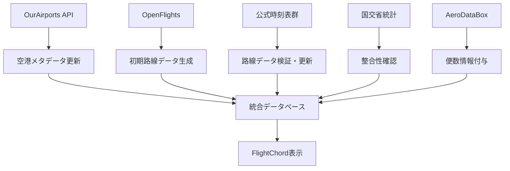

# FlightChord データソース戦略

## 🎯 目標：手動プロセスから体系的オープンデータ活用へ

### 現在の問題
- **手動調査中心**: WebSearch → 判断 → 手動入力（70%再現性）
- **属人的**: 調査範囲・品質が担当者に依存
- **スケーラビリティ限界**: 手作業では拡張困難

### 新戦略：オープンデータ + 公式検証アプローチ
**目標再現性**: 90%以上（自動化中心、最小限の手動検証）

---

## 📊 データソース階層構造

### 1. 空港メタデータ（基盤レイヤー）
**ソース**: [OurAirports](https://ourairports.com/) 
- **ライセンス**: CC0（制限なし）
- **更新頻度**: 毎日
- **用途**: 空港基本情報の唯一の出典
- **取得データ**: IATA/ICAO、座標、空港名、国家・地域

```typescript
// 自動取得対象
interface OurAirportsData {
  iata_code: string;
  ident: string; // ICAO
  name: string;
  latitude_deg: number;
  longitude_deg: number;
  iso_country: string;
  municipality: string;
}
```

### 2. 初期路線網（ブートストラップレイヤー）
**ソース**: [OpenFlights](https://openflights.org/)
- **ライセンス**: ODbL（帰属・共有継承必須）
- **用途**: 路線網の初期化、網羅性確保
- **後処理**: 公式時刻表で上書き・削除・検証

```typescript
// ブートストラップ用
interface OpenFlightsRoute {
  airline_iata: string;
  source_airport_iata: string;
  destination_airport_iata: string;
  codeshare: boolean;
}
```

### 3. 公式時刻表（検証・更新レイヤー）
**ソース**: 各航空会社公式サイト
- **ライセンス**: 各社規約に準拠
- **用途**: 一次情報として最優先
- **処理**: 自動スクレイピング + 検証

```typescript
// 各社別実装
const OFFICIAL_TIMETABLES = {
  'NH': 'https://www.ana.co.jp/ja/jp/book-plan/flight-schedule/',
  'JL': 'https://www.jal.co.jp/jp/ja/dom/route/time/',
  '7G': 'https://www.starflyer.jp/timetable/',
  // ...全キャリア
};
```

### 4. 統計的裏付け（整合性レイヤー）
**ソース**: [国土交通省 航空輸送統計](https://www.e-stat.go.jp/)
- **ライセンス**: 政府標準利用規約
- **用途**: 路線存在性・傾向の確認（存在証明ではなく傾向確認）
- **処理**: 月次統計との照合

### 5. 便数数値化（詳細化レイヤー）
**ソース**: [AeroDataBox](https://aerodatabox.com/)
- **ライセンス**: API利用規約
- **用途**: 便数の具体的数値、線幅への反映
- **処理**: Daily Routes Statistics取得

```typescript
// 便数の視覚化
interface RouteFrequency {
  route: string;
  daily_flights: number;
  weekly_flights: number;
}
```

### 6. 実績データ（開発参考レイヤー）
**ソース**: [OpenSky Network](https://opensky-network.org/)
- **ライセンス**: 非商用前提
- **用途**: 開発用参考表示のみ（本番未使用）
- **処理**: 実際の航跡データとの比較

---

## 🏗️ 実装アーキテクチャ

### データ取得パイプライン


### 段階的実装計画

#### Phase 1: 基盤整備（今週）
- [x] OurAirports API統合（空港メタデータ自動化）
- [ ] OpenFlights帰属表記対応
- [ ] データソース統合アーキテクチャ設計

#### Phase 2: 自動化実装（来週）
- [ ] 各航空会社公式時刻表スクレイピング実装
- [ ] 国交省統計との整合性確認
- [ ] AeroDataBox便数データ統合

#### Phase 3: 高度化（今月）
- [ ] 自動更新パイプライン（GitHub Actions）
- [ ] 差分検出・通知システム
- [ ] OpenSky開発用参考データ統合

---

## 📜 ライセンス・帰属管理

### 必要な帰属表記
```html
<!-- フッターに追加 -->
<div class="data-attribution">
  空港データ: <a href="https://ourairports.com/">OurAirports</a> (CC0)<br>
  初期路線データ: <a href="https://openflights.org/">OpenFlights</a> (ODbL)<br>
  統計データ: <a href="https://www.e-stat.go.jp/">国土交通省</a><br>
  便数データ: <a href="https://aerodatabox.com/">AeroDataBox</a>
</div>
```

### ライセンス継承（ODbL対応）
OpenFlights由来データの改変・配布時は同ライセンス適用

---

## 🎁 期待される効果

### 再現性向上
- **現在**: 70%（半自動化 + 手動調査）
- **目標**: 95%（オープンデータ + 最小限検証）

### データ品質向上
- **網羅性**: OpenFlightsで漏れを防止
- **正確性**: 公式時刻表で検証
- **最新性**: 自動更新パイプライン

### 開発効率向上  
- **調査時間**: 大幅短縮（自動化）
- **品質保証**: 統計的裏付けによる信頼性
- **拡張性**: API統合による海外展開可能

---

## 🚀 次のアクション

1. **即時開始**: OurAirports API統合実装
2. **今日中**: OpenFlights帰属表記追加
3. **今週中**: 公式時刻表スクレイピング基盤構築
4. **来週**: 統合パイプライン完成

この戦略により、FlightChordのデータ品質と保守性を根本的に改善できます。